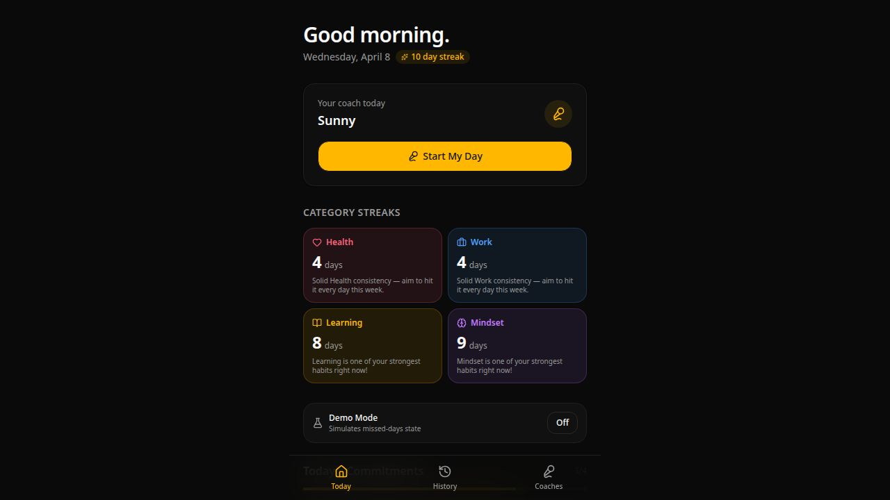

# Judge Guide

## What DayCoach Solves

Most productivity apps stop at task capture. DayCoach focuses on the harder part: following through.

It combines voice, accountability, and behavior-aware coaching so the user can:

- check in with a coach in the morning or evening
- talk through vague or weak tasks in a dedicated review flow
- update tasks live during a conversation
- reflect honestly on what got done at the end of the day

## What To Look For In The Demo

### Voice feels useful, not gimmicky
The app is designed around conversation as the main interface, not as a decorative add-on.

### The coach adapts
The user does not always get the same tone. The app selects different coaching personas based on streaks, missed days, and completion behavior.

### The app responds in real time
During a live session, the coach can trigger task actions immediately. This is not just voice output; it changes the product state.

Today those live actions are:

- adding a task
- marking a task complete

### ElevenLabs is deeply integrated
This project uses multiple parts of the ElevenLabs stack in a practical way:

- Conversational AI
- client tools
- post-call webhook
- Voice Design API
- TTS

### It is built like a real product
This is not a one-screen prototype. It uses a typed API, a real database, generated contracts, persistent task/history flows, and deployment-friendly architecture.

## Best Demo Flow

### 1. Show the home screen
Point out:

- today’s coach
- streak and completion context
- the voice entry points
- the categorized task list

### 2. Start a voice session
Use **Start My Day** or **Review Tasks with Coach**.

Show that the coach:

- understands the current task list
- pushes for specificity
- behaves differently depending on the persona

### 3. Trigger a live task action
Ask the coach to add a task or mark one complete.

This is the strongest proof point because the user sees the app state change during the conversation.

### 4. Show the task intelligence layer
Add a vague task manually and show that the app:

- detects weak wording
- suggests a more specific version
- can generate spoken coaching feedback

### 5. End with reflection
Use **End My Day** to show emotional tone, accountability, and behavior-aware responses.

## Why This Fits The Hackathon

- It uses **Replit** as a realistic deployment path for a usable web app
- It uses **ElevenLabs voice technology** as a core product mechanic
- It demonstrates a clear consumer use case with immediate value
- It is easy to understand quickly and compelling to watch in a short demo

## One-Sentence Pitch

DayCoach is a voice-powered accountability coach that helps you plan your day, stay honest about execution, and feel like you are reporting to someone who actually remembers how you’ve been showing up.
